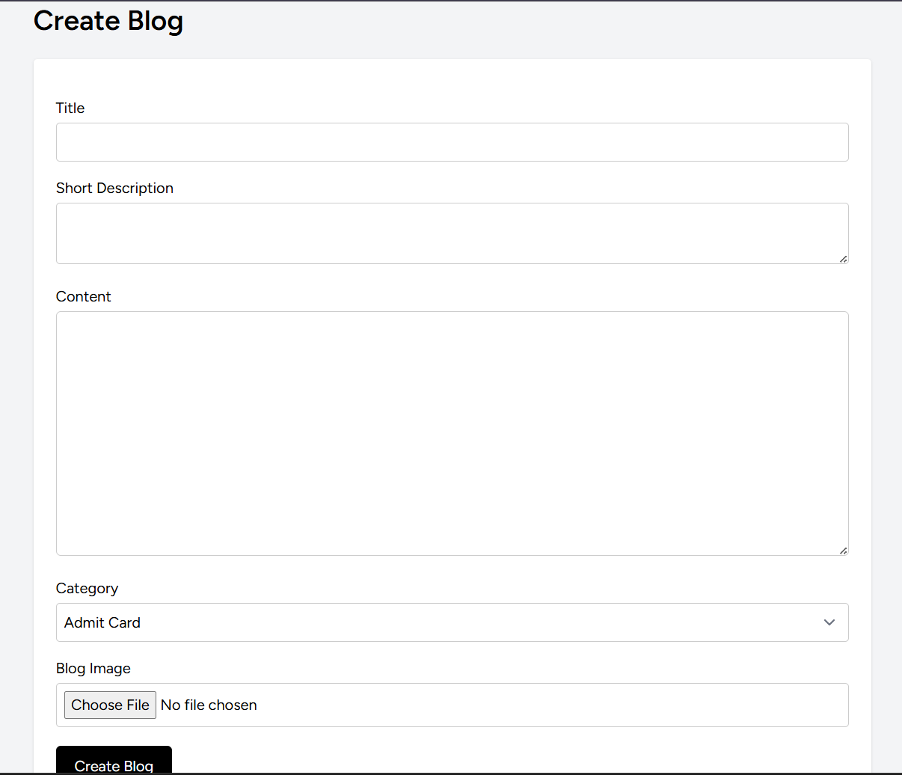
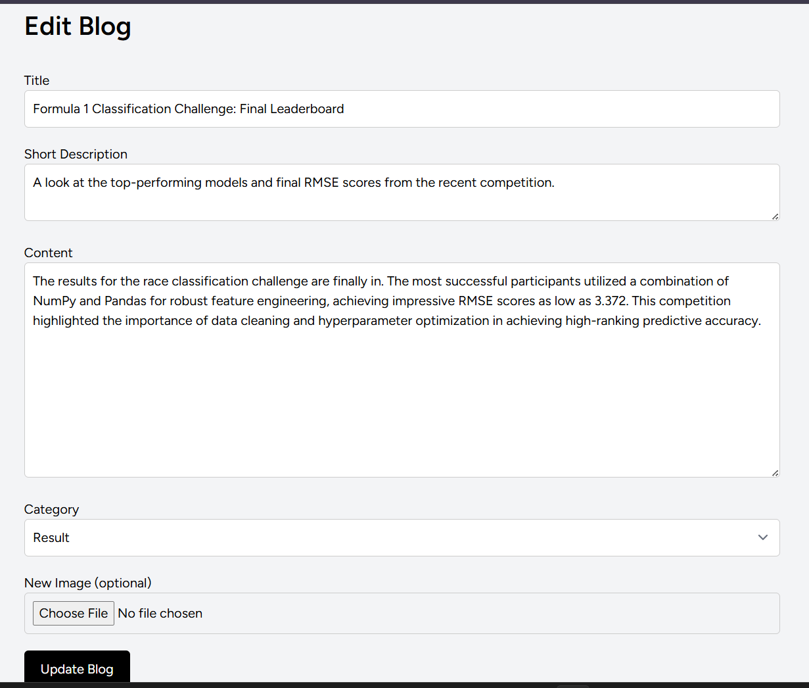
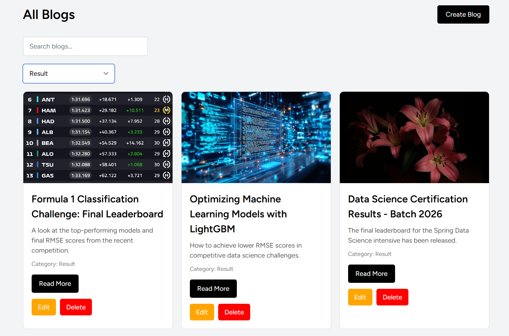
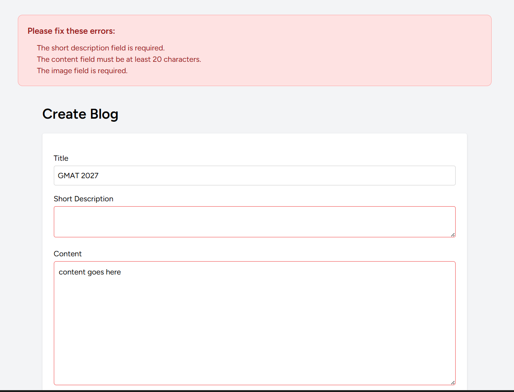

# JobYaari Blog System

A modern Blog Management System built using Laravel, MySQL, Blade, AJAX, and Tailwind CSS.

---

## Features

- User Authentication (Login / Register)
- Create, Edit, Delete Blogs
- Blog Categories
- AJAX Live Search
- AJAX Category Filtering
- Pagination
- Blog Detail Page
- Recent Blogs Sidebar
- Image Upload
- Validation Handling
- Responsive UI
- Success / Error Messages
- Loading Spinner
- Delete Confirmation Popup

---

## Tech Stack

| Layer | Technology |
|-------|-----------|
| Backend | Laravel 12, PHP |
| Database | MySQL |
| Frontend | Blade Templates, Tailwind CSS, JavaScript |
| Interactivity | AJAX |
| Rich Text | TinyMCE *(optional)* |

---

## Installation

### 1. Clone the repository

```bash
git clone YOUR_GITHUB_REPO_LINK
```

### 2. Open the project folder

```bash
cd project-name
```

### 3. Install dependencies

```bash
composer install
npm install
```

### 4. Create the environment file

```bash
cp .env.example .env
```

### 5. Generate app key

```bash
php artisan key:generate
```

### 6. Configure database

Open `.env` and update the following values to match your local setup:

```env
DB_DATABASE=your_database_name
DB_USERNAME=your_username
DB_PASSWORD=your_password
```

### 7. Run migrations

```bash
php artisan migrate
```

### 8. Create storage link

```bash
php artisan storage:link
```

### 9. Start the development server

```bash
php artisan serve
npm run dev
```

---

## Screenshots

### Home Page

 
### Home Page (Alternate View)

 
### Create Blog

 
### Edit Blog

 
### Single Blog Page

 
### Search Feature

 
### Search Results

 
### Category Filter

 
### Error Page


---

## Future Improvements

- Rich text editor improvements
- Dark mode
- Blog comments
- Admin roles
- Tags system

---

## Author

Developed by **Samriddhi Bhowmik**